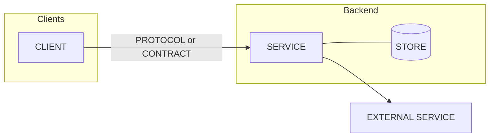
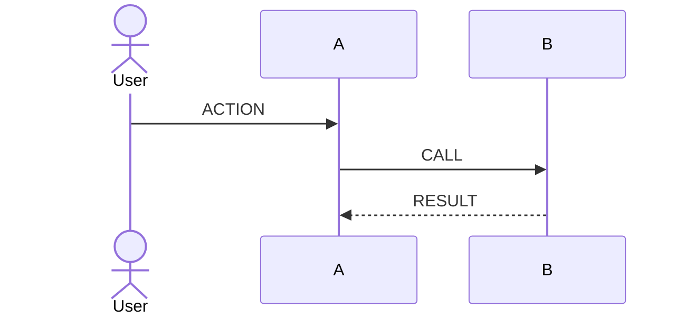

# Architecture

<!-- Product repos (P19); infrastructure when it has moving parts. How the
system fits together now. ADRs hold the reasons; this doc links them and wins
on nothing: where they disagree, the ADR wins and this doc is fixed. Budget:
40 KB; split by topic beyond that (e.g. architecture/data-model.md). -->

**Updated:** <YYYY-MM-DD>

## In one paragraph

**<Headline: the shape in one line, e.g. "A single backend, thin
clients".>**

<What the system is, its main parts, and the one or two ideas that shape
everything else.>

## System diagram

<!-- Group by boundary (clients / our system / services we rent). Same
encoding as the visuals: our code, apps people touch, rented services, data
stores, dashed = boundary or not yet built. Caption: who calls whom. -->

## Principles

<!-- Three to six rules that decide design questions, each with its ADR. -->
1. **<principle>.** <one sentence> ([ADR-NNNN](adr/NNNN-....md))

## Components

| Component | Responsibility | Owns data | Talks to | Decision |
|---|---|---|---|---|
| <name> | <one line> | <tables / buckets> | <components> | ADR-NNNN |

## Key flows

<!-- The two or three flows that matter most, as sequence diagrams. -->

## Cross-cutting concerns

<!-- One short paragraph each, linking the detailed doc or ADR. Omit rows
that do not apply. -->

| Concern | How | Detail |
|---|---|---|
| Identity and access | 
 | ADR-NNNN |
| Data and privacy | 
 | <doc> |
| Environments and hosting | 
 | [operations.md](operations.md) |
| Observability | 
 | [operations.md](operations.md) (manifest) |
| Backup and recovery | 
 | <doc> |
| Secrets | <names and where they live, never values> | <doc> |

## Constraints and limits

- <limit> — <source>

## Room for later

- <future feature> — <what the design already allows, what it would need>
