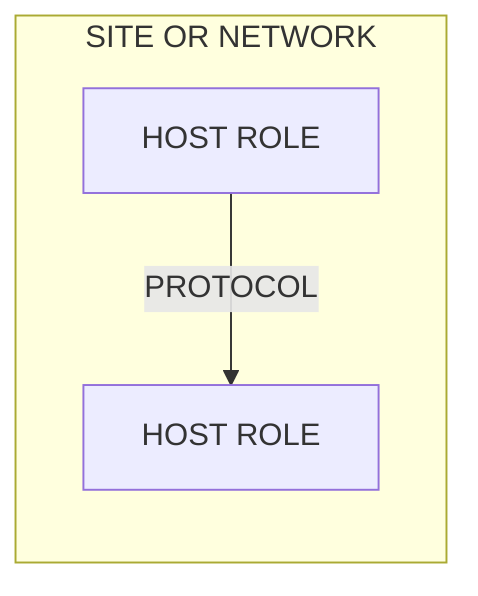

# Inventory

<!-- Infrastructure repos (P19). What runs where, now. The drift check
compares this with the live configuration; a mismatch is a finding. Names
and roles only: no secrets, no private keys (P10). Budget: 30 KB. -->

**Updated:** <YYYY-MM-DD> · **Checked against live:** <YYYY-MM-DD>

## At a glance

## Hosts

| Host | Role | Hardware / size | OS | Reached by | Managed by |
|---|---|---|---|---|---|
| <name> | <role> | <cpu, ram, disk> | <os version> | <address or address or private network name> | <this repo path / manual> |

## Services

| Service | Runs on | Version policy | Exposed at | Data | Owner doc |
|---|---|---|---|---|---|
| <name> | <host> | <pinned / latest stable> | <URL or internal only> | <volume / path> | <runbook link> |

## Network and access

<Networks, DNS, ingress, firewall rules, who can reach what. Link config
files rather than copying them.>

## External accounts

| Account | Used for | Owner | Renewal |
|---|---|---|---|
| <provider> | <purpose> | me | <date or auto> |

## Manual state

<!-- Anything not reproduced by code in this repo. Each item is a risk;
aim to shrink this list. -->
- <item> — <why manual, how to recreate>
