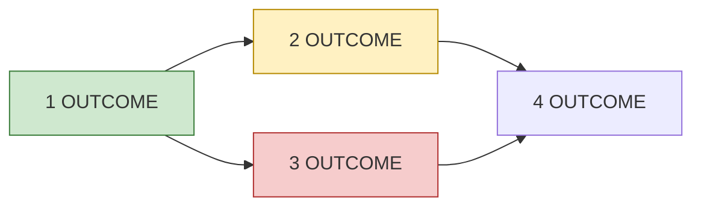

# Phase <N>: <name>

<!-- The current phase, at a glance (P19). One screen should tell me where
it stands. This file owns status: every session that changes a package's
status updates it here, and only here. What each package must deliver lives
in docs/plans/phase-<N>.md (templates/docs/phase-plan.md), which carries no
status. Plain words: rows name what they deliver; the Packages column maps
them to that file's package IDs, the only IDs used. Replaced when the phase
ends, after its outcomes move to the roadmap and docs. Budget: 20 KB. -->

**Goal:** <what the user can see or do when this phase ends>
**Status:** <on track | at risk | blocked> — <one sentence why>
**Progress:** <done>/<total> packages · **Started:** <date> · **Expected:** <date range>
**Waiting on me:** <decision or acceptance, with link — or "nothing">

## Order

<!-- The dependency picture. Keep under ~15 nodes; group small items. -->

## Items

<!-- One row per deliverable, in user terms, with one status. Group done
packages; give each open package its own row. Status: Done, In review, In
progress, Ready, Not started, Blocked: <why>, Parked: <why>. Needs = open
packages only. Link = PR or issue URL (P18), or the package's section in
the phase plan until a PR exists. -->

| Delivers | Packages | Status | Needs | Link |
|---|---|---|---|---|
| <plain-language outcome> | WP<A>, WP<B> | Done | — | <PR URL> |
| <outcome> | WP<C> | In progress | — | <PR URL> |
| <outcome> | WP<D> | Blocked: <why> | WP<C> | <phase plan section URL> |

## Acceptance

<What I will check to accept the phase, as the user would experience it.
Evidence per the acceptance-evidence skill.>

## Not in this phase

- <item> — <which phase or "later">

## Risks

<!-- Only live ones. Omit if none. -->
- <risk> — <mitigation>
