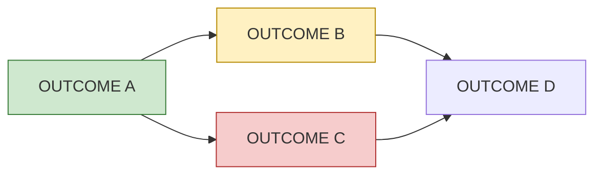

# Phase <N>: <name>

<!-- The current phase, at a glance (P19). One screen should tell me where
it stands. The only place for status (practices/planning.md, "Two files per
phase"). Plain words: rows name what they deliver; package IDs appear only in
the Packages column. Replaced when the phase ends, after its outcomes move to
the roadmap and docs. Budget: practices/record-keeping.md. -->

**Goal:** <what the user can see or do when this phase ends>
**Status:** <on track | at risk | blocked> — <one sentence why>
**Progress:** <done>/<total> packages · **Started:** <date> · **Expected:** <date range>
**Waiting on me:** <decision or acceptance, with link — or "nothing">

## Order

<!-- The dependency picture. Keep under ~15 nodes; group small items. -->

## Items

<!-- One row per deliverable, in user terms, with one status; split a
deliverable only where its packages' statuses differ. Status: Done, In
review, In progress, Ready, Not started, Blocked: <why>, Engineering
complete: <what is externally blocked>, Parked (link the phase plan's
section; the reason lives there). Needs = open packages only. Link = PR or
issue URL, or the package's section in the phase plan as a SHA permalink
(P18) until a PR exists. -->

| Delivers | Packages | Status | Needs | Link |
|---|---|---|---|---|
| <plain-language outcome> | WPA, WPB | Done | — | <PR URL> |
| <outcome> | WPC | In progress | — | <PR URL> |
| <outcome> | WPD | Blocked: <why> | WPC | <phase plan section, SHA permalink> |

## Acceptance

<What I will check to accept the phase, as the user would experience it.
Evidence per the acceptance-evidence skill.>

## Not in this phase

- <item> — <which phase or "later">

## Risks

<!-- Only live ones. Omit if none. -->
- <risk> — <mitigation>
