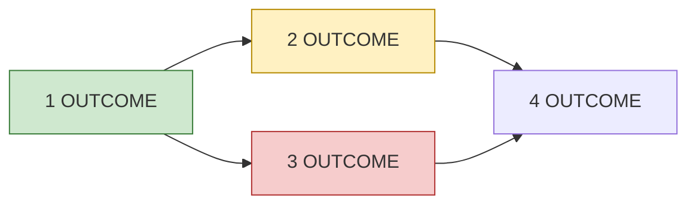

# Phase <N>: <name>

<!-- The current phase, at a glance (P19). One screen should tell me where
it stands. Plain words: name items by what they deliver, not by internal IDs
or module names. Detail per item (files, acceptance criteria, commands) lives
in briefs and PRs, not here. Replaced when the phase ends, after its outcomes
move to the roadmap and docs. Budget: 20 KB. -->

**Goal:** <what the user can see or do when this phase ends>
**Status:** <on track | at risk | blocked> — <one sentence why>
**Progress:** <done>/<total> items · **Started:** <date> · **Expected:** <date range>
**Waiting on me:** <decision or acceptance, with link — or "nothing">

## Order

<!-- The dependency picture. Keep under ~15 nodes; group small items. -->

## Items

<!-- One row per deliverable, in user terms. Status: Done, In review, In
progress, Ready, Blocked, Not started. Link = PR or issue URL (P18). -->

| # | Delivers | Status | Needs | Link |
|---|---|---|---|---|
| 1 | <plain-language outcome> | Done | — | <PR URL> |
| 2 | <outcome> | In progress | 1 | <PR URL> |
| 3 | <outcome> | Blocked: <why> | 1, 2 | <issue URL> |

## Acceptance

<What I will check to accept the phase, as the user would experience it.
Evidence per the acceptance-evidence skill.>

## Not in this phase

- <item> — <which phase or "later">

## Risks

<!-- Only live ones. Omit if none. -->
- <risk> — <mitigation>
