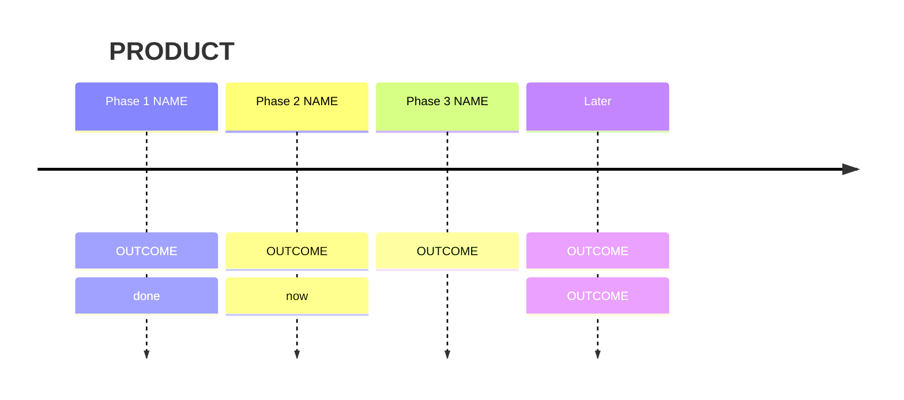

# Roadmap

<!-- Product repos (P19). Where the product is going, readable in two
minutes. Outcomes, not tasks: tasks live in plan.md. Current state only; git
keeps history (P17). Budget: 20 KB. -->

**Status:** Phase <N>, <name> — <on track | at risk: why> · **Updated:** <YYYY-MM-DD>

## Vision

**<One-line headline: the promise, in the user's words.>**

<Two or three sentences: who it is for, what it lets them do, what it will
never be. Order is the commitment; dates are set separately.>

## Phases at a glance

### Phase 1: <name> · <small | medium | large> · Done <YYYY-MM-DD>

<!-- Milestone flag when it applies: ★ FIRST LOOK / RELEASE / COMPLETE -->
- <what it delivers, in user terms>
- <...>

**Done when:** <the observable moment that ends the phase>

### Phase 2: <name> · <size> · **Now** — [plan](plan.md)

- <deliverable>

**Done when:** <...>

<!-- Every phase ends with something a user can see or use. Sizes are
ranges; re-estimate from measured throughput and say when. -->

## Parallel track: outside engineering

<!-- Runs alongside from day one: accounts, contracts, content, legal,
decisions only I can make. Omit if none. -->

| Item | Blocks | Owner | Status |
|---|---|---|---|
| <item> | Phase <N> | me | <waiting since date / done> |

## Later, unscheduled

- <idea> — <why not yet>

## Deliberately not planned

- <thing> — <reason or ADR>
